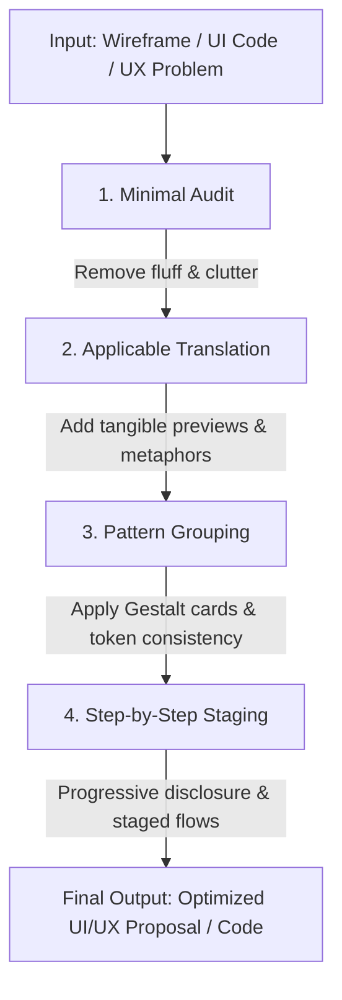

# M.A.P.S Cognitive UI/UX Design Framework

A cognitive psychology-driven skill for designing intuitive, low-friction, high-conversion user interfaces and experiences.

---

## 🧠 Core Philosophy: The 4 Pillars of M.A.P.S

| Pillar | Core Meaning | UI/UX Objective | Golden Rule |
| :--- | :--- | :--- | :--- |
| **M - Minimal (精簡)** | Avoid cognitive overload; eliminate noise | Reduce mental strain (Hick's & Miller's Law) | **1 Primary CTA per viewport; cut 30% of non-essential noise.** |
| **A - Applicable (具體化)** | Provide tangible, relatable contexts & scenarios | Bridge mental models; intuitive affordance | **Show concrete previews, real-world metaphors, and human microcopy.** |
| **P - Patterns (分類/模式)** | Exploit innate visual & Gestalt pattern recognition | Enable instant scanning over sequential reading | **Use consistent design tokens, chunking cards, and semantic colors.** |
| **S - Step by Step (由簡入繁)** | Gradually increase complexity (Progressive Disclosure) | Build momentum & decrease initial entry barriers | **Split complex tasks into staged phases; reveal complexity on demand.** |

---

## 🎯 When to Activate This Skill

Activate this skill whenever:
1. **Designing New Features / Pages**: Wireframing, structuring layouts, building checkout/signup flows, or dashboard design.
2. **UI/UX Audit & Code Review**: Evaluating frontend code, components, or screens for usability bottlenecks, clutter, and high drop-off rates.
3. **Complex Form Simplification**: Refactoring dense settings pages, enterprise data tables, or multi-field forms.
4. **Onboarding & First-Time User Experience (FTUE)**: Designing tutorials, empty states, and guided tours.
5. **Microcopy & Error Handling**: Rewriting error alerts, empty states, tooltips, and instructional copy.

---

## 🛠️ Operational Workflows

### 1. The Minimal (精簡) Audit
* **Signal-to-Noise Ratio**: Remove redundant borders, heavy drop-shadows, repetitive icon labels, and filler words.
* **1 Primary Action Rule**: Exactly one dominant visual call-to-action (CTA) per view state. Secondary actions must use outline or ghost button styles.
* **Zero-Noise Defaults**: Pre-fill sensible defaults so 80% of users don't need to tweak configuration.
* **White Space as Structure**: Use 8px spacing scales (`p-2`, `p-4`, `gap-4`) instead of dividing lines to separate content.

### 2. The Applicable (具體化) Transformation
* **Live Previews Over Numeric Configs**: When tweaking settings (e.g., theme, layout, card size), show a dynamic live preview box instead of just dropdowns or sliders.
* **Human-Centric Microcopy**:
  - ❌ *Abstract*: "Invalid authorization header (Code 401)"
  - ✅ *Applicable*: "Your session expired. Please sign in again to save your changes."
* **Actionable Empty States**: Never leave a blank page. Show a lightweight illustration/skeleton with a concrete prompt (e.g., *"No projects yet — Start by choosing a template"*).
* **Affordance & Metaphor**: Interactive elements must look clickable (hover states, subtle elevation, standard cursor `pointer`).

### 3. The Patterns (分類) Structuring
* **Gestalt Visual Chunking**: Group related fields into dedicated Cards or Section Containers.
* **Visual Hierarchy (F & Z Patterns)**:
  - Top-left: Context & title.
  - Top-right: Global actions or status badges.
  - Center/Body: Scannable list/card patterns.
  - Bottom-right: Forward progression CTA.
* **Predictable Semantics & Jakob's Law**:
  - Success = Green, Warning = Amber/Orange, Danger = Red, Primary = Brand Blue/Violet.
  - Keep standard navigation conventions (Search 🔍 top/sidebar, Profile top-right, Settings ⚙️).
* **High Scannability**: Use bold key-metrics, pill badges (`Active`, `Pending`), and avatar clusters instead of pure text rows.

### 4. The Step by Step (由簡入繁) Pacing
* **Progressive Disclosure**:
  - Show only core essentials first (80% use case).
  - Tuck advanced/edge-case settings behind "Advanced Options ▾" accordions or modals.
* **Staged Multi-Step Wizards**:
  - Break forms with >6 inputs into numbered phases (e.g., `1. Account` → `2. Preferences` → `3. Launch`).
  - Provide a visible breadcrumb / progress bar to show momentum.
* **Frictionless Onboarding (Just-in-Time Learning)**:
  - Avoid 10-step upfront tooltips. Provide contextual hints only when the user triggers that specific tool.
* **Paced Animations**: Use 150ms–250ms ease-out transitions for reveals to orient user focus without sluggishness.

---

## 📋 M.A.P.S UI/UX Evaluation Scorecard (Quick Run)

When reviewing any screen or UI component, score it from 1 to 5 against each pillar:

| Criterion | Key Verification Question | Score (1-5) |
| :--- | :--- | :--- |
| **M** | Is the interface free of visual clutter, with only 1 primary CTA? | |
| **A** | Are messages concrete, with live previews or actionable examples? | |
| **P** | Are elements clearly chunked with consistent design tokens and recognizable patterns? | |
| **S** | Is complexity introduced gradually through progressive disclosure and staged steps? | |
| **Total** | **Target: ≥ 16 / 20** | **/ 20** |

---

## 📚 Deep-Dive References

- [Cognitive Psychology Framework](./references/cognitive_framework.md) - Theoretical foundations (Miller, Hick, Gestalt, Sweller).
- [Comprehensive UI/UX Checklist](./references/uiux_checklist.md) - Detailed 20-point actionable audit list.
- [Before & After UI Transformation Examples](./references/before_after_examples.md) - Real-world design refactoring patterns.
